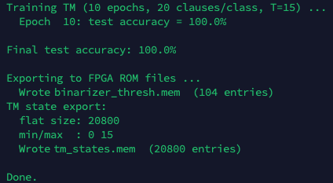
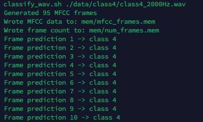
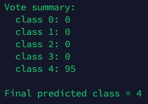

# MFCC-Based Tsetlin Machine Audio Classification with Python Training and Verilog-Based Inference

This project generates a synthetic audio dataset consisting of five classes. Each class is represented by a 1-second sine wave recording with a distinct frequency (400 Hz, 800 Hz, 1200 Hz, 1600 Hz, and 2000 Hz). MFCC features are extracted in Python using the [Librosa](https://github.com/librosa/librosa) library, binarized using Q8.8 thermometer encoding, and used to train a Tsetlin Machine classifier model with [TMU](https://github.com/cair/tmu). The trained model is then exported to Verilog compatible memory (.mem) files. The RTL simulation (run with [Icarus Verilog](https://steveicarus.github.io/iverilog/)) streams MFCC frames through a binarizer and Tsetlin Machine inference core, reporting the predicted class for each frame and the final classification by majority vote.

Includes Python scripts for WAV generation, MFCC conversion, TM training, and a parameterized classification script for testing arbitrary WAV files.

## Dataset

Five classes of one-second single frequency sine waves 

- `data/class0/class0_400Hz.wav`
- `data/class1/class1_800Hz.wav`
- `data/class2/class2_1200Hz.wav`
- `data/class3/class3_1600Hz.wav`
- `data/class4/class4_2000Hz.wav`

## Training
Run: `./train_tm.py`

**binarizer_thresh.mem** contains the 104 threshold values (13 MFCC coefficients × 8 thresholds per coefficient) used for thermometer encoding, converting continuous MFCC coefficients into the 104-bit binary feature vectors required by the Tsetlin Machine. The thresholds are derived once (!) from the training dataset using percentile-based quantization to provide a good coverage of the observed MFCC value range and remain fixed during both training and inference.

**tm_states.mem** contains the trained states of all Tsetlin Automata (TAs) and therefore represents the learned model parameters. During FPGA synthesis, these states are loaded into on-chip BRAMs and are used by the inference engine to classify incoming feature vectors.

## Inference
Run: `./classify_wav.sh data/class4/class4_2000Hz.waw`

### Per Frame

### Per Wave File (Class Decision per Majority Vote)
Let `./classify_wav.sh ...` complete 95 frames

### Generate Wave Files with specified Frequency
